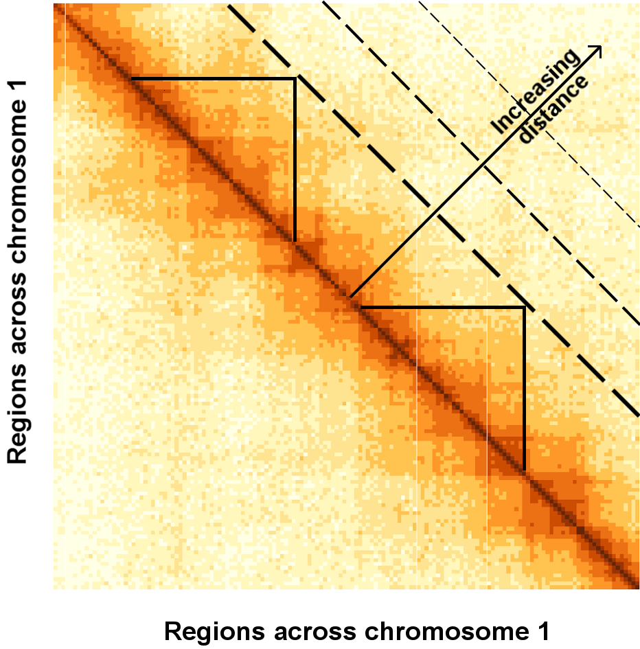
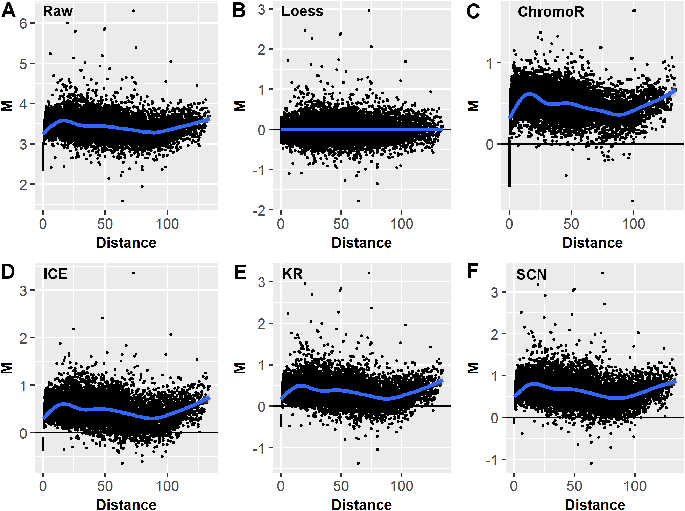

John C. Stansfield^1,3^, Kellen G. Cresswell^1^, Vladimir I. Vladimirov^2^, Mikhail G. Dozmorov^1,3\*^ 

^1^ Dept. of Biostatistics, Virginia Commonwealth University, Richmond, VA, 23298, USA  
^2^ Dept. of Psychiatry, Virginia Institute for Psychiatric and Behavioral Genetics, Richmond, VA, 23219, USA  
^3^ Equal contribution  
^\*^ To whom correspondence should be addressed: Virginia Commonwealth University, Richmond, VA, 23298, 804-827-2055, mikhail.dozmorov@vcuhealth.org

**Running title:** Hi-C data normalization and comparison

**Keywords:** Hi-C, chromosome conformation capture, normalization, comparison, differential analysis, HiCcompare

[Supplemental material is available for this article.]

\break

# Abstract

Changes in spatial chromatin interactions are now emerging as a unifying mechanism orchestrating the regulation of gene expression. Hi-C sequencing technology allows insight into chromatin interactions on a genome-wide scale. However, Hi-C data contains many DNA sequence- and technology-driven biases. These biases prevent effective comparison of chromatin interactions aimed at identifying genomic regions differentially interacting between, e.g., disease-normal states or different cell types. Several methods have been developed for normalizing individual Hi-C datasets. However, they fail to account for biases _between two or more Hi-C datasets_, hindering comparative analysis of chromatin interactions. We developed a simple and effective method, HiCcompare, for the joint normalization and differential analysis of multiple Hi-C datasets. The method introduces a distance-centric analysis and visualization of the differences between two Hi-C datasets on a single plot that allows for a data-driven normalization of biases using locally weighted linear regression (loess). HiCcompare outperforms methods for normalizing individual Hi-C datasets and methods for differential analysis (diffHiC, FIND) in detecting _a priori_ known chromatin interaction differences while preserving the detection of genomic structures, such as A/B compartments. HiCcompare is freely available as a Bioconductor R package [https://bioconductor.org/packages/HiCcompare/](https://bioconductor.org/packages/HiCcompare/).  

# Introduction

The 3D chromatin structure of the genome is emerging as a unifying regulatory framework orchestrating gene expression by bringing transcription factors, enhancers and co-activators in spatial proximity to the promoters of genes [@Mifsud:2015aa; @Sexton:2015aa; @Li:2012aa; @Papantonis:2013aa]. Changes in chromatin interactions shape cell type-specific gene expression [@Jin:2013aa; @Lieberman-Aiden:2009aa; @Schmitt:2016aa; @Nora:2012aa], as well as misregulation of oncogenes and tumor suppressors in cancer [@Taberlay:2016aa; @Hnisz:2016aa; @Franke:2016aa] and other diseases [@Li:2012aa]. Identifying changes in chromatin interactions is the next logical step in understanding genomic regulation.

Evolution of Chromatin Conformation Capture (3C) technologies into Hi-C sequencing now allows the detection of "all vs. all" long-distance chromatin interactions across the whole genome [@Lieberman-Aiden:2009aa; @Sanborn:2015aa]. Soon after public Hi-C datasets became available, it was clear that technology- and DNA sequence-driven biases substantially affect chromatin interactions [@Yaffe:2011aa]. The technology-specific biases include cutting length of a restriction enzyme (HindIII, MboI, or NcoI), cross-linking conditions, circularization length, etc. The DNA sequence-driven biases include GC content, mappability, nucleotide composition. Discovery of these biases led to the development of methods for normalizing individual datasets [@Cournac:2012aa; @Lieberman-Aiden:2009aa; @Imakaev:2012aa; @Yaffe:2011aa; @knight2012fast]. Although normalization of individual datasets improves reproducibility within replicates of Hi-C data [@Imakaev:2012aa; @Yaffe:2011aa], these methods do not consider biases between multiple Hi-C datasets. 

Accounting for the between-dataset biases is critical for the correct identification of chromatin interaction changes between, e.g., disease-normal states, or cell types. Left unchecked, biases can be mistaken for biologically relevant differential interactions. While DNA sequence-driven biases affect two datasets similarly (e.g., CG content of genomic regions tested for interaction differences is the same), technology-driven biases are poorly characterized and affect chromatin interactions unpredictably. Importantly, another source of chromatin interaction differences stems from large-scale genomic rearrangements, such as copy number variations [@Servant:2015aa], a frequent event in cancer genomes [@Rickman:2012aa]. Accounting for such biases is needed for the accurate detection of differential chromatin interactions between Hi-C datasets. 

We developed an R package, HiCcompare, for the joint normalization and comparative analysis of multiple Hi-C datasets, summarized as chromatin interaction matrices. Our method is based on the observation that chromatin interactions are highly stable [@Dixon:2012aa; @Fudenberg:2016aa; @Rao:2014aa; @Schmitt:2016aa], suggesting that the majority of them can serve as a reference to build a rescaling model. We present the novel concept of the MD plot ($M$inus, or difference vs. $D$istance plot), a modification of the MA plot [@dudoit2002statistical]. The MD plot allows for visualizing the differences between interacting chromatin regions in two Hi-C datasets while explicitly accounting for the linear distance between interacting regions. The MD plot concept naturally allows for fitting the local regression model, a procedure termed loess, and jointly normalizing the two datasets by balancing biases between them. The distance-centric view of chromatin interaction differences allows for detecting statistically significant differential chromatin interactions between two Hi-C datasets. We show improved performance of differential chromatin interaction detection when using the jointly vs. individually normalized Hi-C datasets. Our method is broadly applicable to a range of biological problems, such as identifying differential chromatin interactions between tumor and normal cells, immune cell types, and normal tissues/cell types.

# Results

## The off-diagonal concept of distance between regions in chromatin interaction matrices 

Our study focuses on the joint analysis of multiple Hi-C datasets represented by chromatin interaction matrices, where rows and columns represent genomic regions (bins), and cells contain interaction counts (frequencies). The values on the diagonal trace represent interaction frequencies (IFs) of self-interacting regions. Each off-diagonal trace of values represents interaction frequencies for a pair of regions at a given unit-length distance. The unit-length distance is expressed in terms of resolution of the data (the size of genomic regions, typically measured in millions (thousands) of base pairs, MB (KB)). The concept of considering interaction frequencies at each off-diagonal trace is central for the joint normalization and differential chromatin interaction detection (Figure 1).

+-------+
|       |
| **Figure 1. Distance-centric (off-diagonal) view of chromatin interaction matrices.** Each off-diagonal vector of interaction frequencies represents interactions at a given distance between pairs of regions. Triangles mark pairs of genomic regions interacting at the same distance. Data for chromosome 1, K562 cell line, 50KB resolution, spanning 0 - 7.5Mb is shown. |
+-------+

The interaction frequency drops as the distance between interacting regions increases. Numerous attempts have been made to parametrically model the inverse relationship between chromatin interaction frequency and the distance between interacting regions. However, Hi-C data are affected by technology- and DNA sequence-driven biases [@Yaffe:2011aa; @Cournac:2012aa; @Imakaev:2012aa], unpredictably altering chromatin interaction frequencies. Consequently, parametric approaches fail to model interaction frequencies across the full range of distances [@Sanborn:2015aa], confirmed by our observations (Supplemental Figure S1). 

## Elimination of biases in jointly, but not individually, normalized Hi-C data

Discovery of biases in Hi-C data led to the development of numerous methods for normalizing _individual_ datasets [@Lieberman-Aiden:2009aa; @Imakaev:2012aa; @knight2012fast; @Cournac:2012aa]. Although normalization of individual datasets improves reproducibility of replicated Hi-C data [@Imakaev:2012aa; @Yaffe:2011aa], these methods do not explicitly account for biases between _multiple_ Hi-C datasets. The between-dataset biases are particularly problematic when comparing Hi-C datasets between biological conditions (Supplemental File S1). When the detection of chromatin interaction differences due to biology, not biases, is important, normalization that removes the between-dataset biases is critical.  

To assess the between-dataset biases, we visualize two Hi-C datasets on a single MD plot (see Methods). Briefly, differences in chromatin interaction frequencies (**M**inus) are visualized on a per-unit-length distance basis. Chromatin interactions are highly conserved [@Dixon:2012aa; @Fudenberg:2016aa; @Rao:2014aa]; thus, the majority of the **M** differences should be centered around zero. The MD plot visualization allows us to identify systematic biases appearing as the offset of the cloud of **M** differences from zero. Visualizing replicates of Hi-C data (Gm12878 cell line) showed the presence of biases in the individually normalized datasets (Figure 2, Supplemental File S1), suggesting that the performance of individual normalization methods may be sub-optimal when comparing multiple Hi-C datasets.

To account for between-dataset biases, we developed a non-parametric joint normalization method that makes no assumptions about the theoretical distribution of the chromatin interaction frequencies. It utilizes the well-known loess (locally weighted polynomial regression) smoothing algorithm - a regression-based method for fitting simple models to segments of data [@cleveland1979robust]. The main advantage of loess is that it accounts for any local irregularities _between_ the datasets that cannot be modeled by parametric methods. Thus, loess is particularly appealing when normalizing two Hi-C datasets, as the internal biases in Hi-C data are poorly understood (Figure 2).

+-------+
|       |
| **Figure 2.** MD plot data visualization and the effects of different normalization techniques. MD plots of the differences M between two replicated Hi-C datasets (GM12878 cell line, chromosome 11, 1MB resolution, DpnII and MboI restriction enzymes) plotted vs. distance D between interacting regions. (A) Before normalization, (B) after loess joint normalization, (C) ChromoR, (D) Iterative Correction and Eigenvector decomposition (ICE), (E) Knight-Ruiz (KR), (F) Sequential Component Normalization (SCN). |
+-------+

Existing Hi-C data at high resolutions (e.g., 10 kb) still suffer from a limited dynamic range of chromatin interaction frequencies, with the majority of them being small or zero, especially at large distances between interacting regions. This sparsity places limits on loess joint normalization, as it builds a rescaling model from many non-zero pairwise comparisons. A way to alleviate this limitation is to consider interactions only within a range of short interaction distances, where genomic regions interact more frequently, and the proportion of zero interaction frequencies is the lowest. Our evaluation of loess joint normalization showed it performs best at resolutions between 1MB and 50KB (Supplemental File S1, Supplemental File S4). The issue of sparsity limiting the usefulness of loess normalization will be alleviated as sequencing techniques continue to improve and Hi-C datasets with deeper sequencing become available.

## Detecting differential chromatin interactions

To detect significant chromatin interaction differences, we introduced _a priori_ known chromatin interaction differences in replicate data from the GM12878 cell line. The benefits of the joint normalization vs. individually normalized datasets were evaluated in detecting the known differences. HiCcompare is able to detect most of the added differences with a relatively low number of false positives across the range of fold changes (Table 1, Supplemental File S2).

**Table 1. Evaluation of the effect of normalization on differential chromatin interaction detection.** Matthews Correlation Coefficient of detecting 200 controlled differences in jointly (HiCcompare) vs. individually normalized Gm12878 datasets, chromosome 1, 1KB resolution. Matrices were normalized with methods corresponding to column labels, differences were detected using HiCcompare.

<!--Generated from /Users/mdozmorov/Documents/Work/VCU_work/3D_DNA/HiCcompare/supplementary/04_Differential_MCC_summary.csv-->

| Fold change | HiCcompare |   MA  |  ICE  |  SCN  |   KR  | ChromoR |
|:-----------:|:----------:|:-----:|:-----:|:-----:|:-----:|:-------:|
|      2      |    0.847   | 0.823 | 0.835 | 0.768 | 0.748 | 0.149   |
|      3      |    0.973   | 0.934 | 0.802 | 0.721 | 0.764 | 0.380   |
|      4      |    0.995   |  0.98 | 0.953 | 0.881 | 0.868 | 0.532   |
|      5      |    0.972   | 0.967 | 0.748 | 0.722 | 0.755 | 0.609   |

## Comparison with diffHiC

The diffHiC pipeline was designed to process raw Hi-C sequencing datasets and detect chromatin interaction differences using the generalized linear model framework developed in the edgeR package [@Lun:2015aa]. We compared the results of Hi-C data analyzed in the diffHiC paper (human prostate epithelial cells RWPE1 over-expressing the EGR protein or GFP [@Rickman:2012aa]) with the results obtained by HiCcompare. 

diffHic detected a total of 5,737 significant differences (FDR < 0.05), while HiCcompare tended to be more conservative, detecting 314 differences (FDR < 0.05) and 7,620 differences when multiple testing correction was not applied (p-value < 0.05). Of the 314 differences, 121 overlapped with the regions detected by diffHic and of the 7,620 differences, 1,654 overlapped with the regions detected by diffHic. Surprisingly, although diffHiC used CNV correction in their analysis, 2,567 (44.7%) of the detected differentially interacting regions overlapped with CNV regions detected in our analysis, and/or blacklisted regions. diffHic tended to detect differentially interacting regions with smaller fold changes as compared to HiCcompare, and at shorter distances between interacting regions, while HiCcompare can detect differences across the full range of distances (Supplemental File S3). These results suggest that detecting chromatin interaction differences represented in the MD coordinates, as implemented in HiCcompare, may be useful in detecting large chromatin interaction differences across the full range of distances, potentially having a more significant biological effect.

## Comparison with FIND

The recently published FIND tool uses a spatial Poisson process to detect differences between two Hi-C experimental conditions [@Djekidel:2018aa]. FIND is presented as a tool for high resolution Hi-C data and treats interactions as spatially dependent on surrounding interactions. In order to compare HiCcompare with FIND we performed a comparative analysis between Hi-C data from K562 and GM12878 cells lines (Supplemental File S4) as done in the FIND paper [@Djekidel:2018aa]. The maximum resolution of each Hi-C matrix was calculated using the `calculate_map_resolution.sh` function from `Juicer` [@Durand:2016aa]. Briefly, two replicates for each cell line were obtained (see Methods) and the replicate contact matrices were combined for the HiCcompare analysis. HiCcompare was used to jointly normalize the data between the cell lines and then detect differences. HiCcompare analyses were performed at 1MB, 100KB, 50KB, 10KB, and 5KB resolutions. Additionally, the analyses of GM12878 and K562 were used to compare the run times of HiCcompare and FIND (Supplemental File S4).

The number of differences detected by HiCcompare at 5KB resolution was much lower than the number FIND detected (~150,000) [@Djekidel:2018aa]. The drop off of the number of differential interactions detected at high resolution by HiCcompare can be explained by the sparsity and the limited dynamic range of interaction frequencies at 5KB resolution. Additionally, the large number of differences detected by FIND at 5KB resolution is questionable given that the maximum resolution of the K562 and GM12878 data was found to be ~39KB and ~9KB, respectively (Supplemental File S4).

The differentially interacting regions detect by HiCcompare at different resolutions were intersected with gene locations and a KEGG pathway enrichment analysis was performed. The enrichment analysis showed that many of the differential regions contained genes involved in the immune system (Table 2). We also found that the enrichment analyses of HiCcompare-detected differences at each resolution were relatively consistent further indicating the strength of HiCcompare at detecting biologically relevant differences across data resolutions. Despite the differences in resolution of data used for differential analysis (5 kb for FIND and 50 kb - 1 Mb for HiCcompare) the enrichment analysis of HiCcompare-detected differences identified pathways related to the immune system, similarly to the results of FIND analysis. These observations suggest that both methods can detect biologically significant differences.

**Table 2. Gene enrichment results for HiCcompare analyses.** KEGG pathways and their corresponding FDR-corrected p-values for the enrichment analyses of HiCcompare-detected differences at 1MB, 100KB, and 50KB resolutions. Differentially interacting regions detected by HiCcompare were intersected with gene locations, and the overlapping genes were tested for enrichment using EnrichR [@Chen:2013aa].

| Pathway                                  | 1MB       | 100KB     | 50KB      |
|------------------------------------------|-----------|-----------|-----------|
| Systemic lupus erythematosus             | 3.807e-06 | 6.302e-17 | 1.025e-02 |
| Antigen processing and presentation      | 3.807e-06 | 6.808e-01 | 9.974e-01 |
| Staphylococcus aureus infection          | 8.170e-03 | 2.354e-01 | 7.604e-01 |
| Viral myocarditis                        | 8.170e-03 | 1.038e-01 | 9.657e-01 |
| Allograft rejection                      | 8.170e-03 | 1.518e-01 | 9.974e-01 |
| Viral carcinogenesis                     | 3.327e-02 | 3.659e-08 | 3.273e-01 |
| Pathways in cancer                       | 9.162e-01 | 2.236e-02 | 9.409e-01 |

<!--
| Pathway                                  | 1MB       | 100KB     | 50KB      |
|------------------------------------------|-----------|-----------|-----------|
| Antigen processing and   presentation    | 3.807e-06 | 6.808e-01 | 9.974e-01 |
| Graft-versus-host disease                | 3.807e-06 | 2.700e-01 | 9.974e-01 |
| Systemic lupus erythematosus             | 3.807e-06 | 6.302e-17 | 1.025e-02 |
| Phagosome                                | 5.098e-03 | 3.514e-01 | 9.974e-01 |
| Staphylococcus aureus   infection        | 8.170e-03 | 2.354e-01 | 7.604e-01 |
| Viral myocarditis                        | 8.170e-03 | 1.038e-01 | 9.657e-01 |
| Allograft rejection                      | 8.170e-03 | 1.518e-01 | 9.974e-01 |
| Viral carcinogenesis                     | 3.327e-02 | 3.659e-08 | 3.273e-01 |
| Pathways in cancer                       | 9.162e-01 | 2.236e-02 | 9.409e-01 |
| Proteoglycans in cancer                  | 5.147e-01 | 2.236e-02 | 8.146e-01 |
| Rap1 signaling pathway                   | 1.000e+00 | 2.236e-02 | 9.942e-01 |
| ErbB signaling pathway                   | 1         | 2.236e-02 | 9.974e-01 |
| Chronic myeloid leukemia                 | 1         | 9.004e-02 | 6.107e-01 |
| Bacterial invasion of   epithelial cells | 1         | 2.263e-01 | 1.484e-01 |
| Platelet activation                      | 1         | 1.706e-01 | 2.884e-01 |
| Viral carcinogenesis                     | 3.327e-02 | 3.659e-08 | 3.273e-01 |
| PI3K-Akt signaling pathway               | 1         | 9.448e-01 | 3.540e-01 |
| Focal adhesion                           | 9.680e-01 | 1.706e-01 | 3.385e-01 |
| Rheumatoid arthritis                     | 2.302e-02 | 8.777e-01 | 9.974e-01 |
| Toxoplasmosis                            | 2.768e-01 | 1.706e-01 | 3.755e-01 |
-->

To compare the performance of FIND and HiCcompare we used replicate data for GM12878 cells. The GM12878 replicates are expected to contain minimal differences, thus amenable for introducing _a priori_ controlled changes (see Methods) and applying both tools in order to detect them. HiCcompare successfully detected the majority of the controlled changes while FIND detected smaller differences and was missing most of the introduced controlled changes (Supplemental File S4). Additionally, we found that the run time of FIND on Hi-C matrices at resolutions between 100KB and 10KB was extremely long (>72 hours) even when run in parallel on 16 cores, while HiCcompare was able to complete analysis within minutes (Supplemental Fig. 1.1). These results further strengthen the notion that HiCcompare detects large chromatin interaction differences potentially having larger biological impact on genome structure, and does it across the full range of distances.

## Preservation of A/B compartments

A/B compartments are the best known genomic structures that can be detected from Hi-C data [@Lieberman-Aiden:2009aa]. To understand the consequences of the joint vs. individual normalization methods on the detection of A/B compartments we compared principal components defining compartments in raw vs. normalized data. A/B compartments detected following joint normalization were the most similar to those detected in the raw data (Table 3). These results suggest that the joint HiCcompare normalization preserves properties of Hi-C data needed for the accurate detection of A/B compartments.

**Table 3. Similarity between A/B compartments detected following various normalization methods.** "Correlation" - Pearson correlation coefficient between principal components defining A/B compartments in raw vs. normalized Hi-C data; "Prop. Match Sign" - the proportion of regions with matching signs defining A/B compartments; "Jaccard A/B" - Jaccard overlap statistics between A/B compartments, respectively. All values represent averages over all chromosomes.

|   Comparison       | Correlation | Prop. Match Sign | Jaccard A | Jaccard B |
|:------------------:|:-----------:|:----------------:|:---------:|:---------:|
| HiCcompare vs. Raw |    0.9954   |      0.8537      |   0.8719  |   0.8284  |
|  SCN vs. Raw       |    0.9309   |      0.8083      |   0.6641  |   0.5737  |
|  ICE vs. Raw       |    0.9795   |       0.785      |   0.6969  |   0.6141  |

Taken together, our results demonstrate the importance of the joint normalization when comparing Hi-C datasets. We introduce the concept of distance-centric view of Hi-C data, implemented as an intuitive distance-centric visualization of two Hi-C datasets on the MD plot. The MD plot representation allows for the joint loess normalization that improves power in detecting true chromatin interaction differences and preserves data properties needed for the accurate detection of A/B compartments. The HiCcompare R package implements the visualization, joint normalization, and differential chromatin interaction detection algorithms, allowing for the comparison of Hi-C data.

# Discussion

This work introduces three novel concepts for the joint normalization and differential analysis of Hi-C data, implemented in the HiCcompare R package. First, we introduce the representation of the differences between two Hi-C datasets on an MD plot, a modification of the MA plot [@dudoit2002statistical]. Importantly, we consider the data on a per-distance basis, allowing the data-driven normalization of global biases without distorting the relative distribution of interaction frequencies of the interacting regions. Second, we implement a non-parametric loess normalization method that minimizes bias-driven differences between the datasets. There is compelling evidence that non-parametric normalization methods, such as quantile- and loess normalization, are particularly suitable for removing between-dataset biases [@Shao:2012aa; @Bolstad:2003aa], confirmed by our application of loess to the joint normalization of Hi-C data. Third, we develop and benchmark a simple but rigorous statistical method for the differential analysis of Hi-C datasets.

The importance of joint normalization in removing between-dataset biases has been demonstrated using the MA normalization introduced in the diffHiC R package [@Lun:2015aa]. MA normalization uses a similar concept of representing measures from two datasets on a single plot [@Lun:2015aa], except it uses the **A**verage chromatin interaction frequency as an X-axis instead of the **D**istance used by us. MA normalization performed second to HiCcompare (Table 1, Supplemental File S2). This may be due to the power-law decay of interaction measures leading to the limited dynamic range of average chromatin interaction frequencies and making fitting a loess curve difficult. Instead, the more balanced representation of chromatin interaction differences **M** (Y-axis) as a function of distance **D** (X-axis) improves the performance of loess fit for the joint normalization and the subsequent detection of chromatin interaction differences.

The discrepancy of differential chromatin interaction detection between diffHiC and HiCcompare (Supplemental File S3) could arise from multiple factors. diffHiC's implementation of MA normalization favors differences at shorter distances and small fold changes while HiCcompare's loess fitting through the MD plot allows for the detection of large chromatin interaction differences across the full range of interaction frequencies (Supplemental File S3). diffHiC operates on logCPM counts while HiCcompare uses log interaction frequency counts. diffHiC uses enzyme cut sites to define bins when partitioning the genome while HiCcompare uses fixed bin sizes. diffHiC uses median inter-chromosomal interaction frequency cutoff to filters low-abundance bin pairs while HiCcompare filters based on average IFs of the chromosome being considered. Finally, the RWPE1 data analyzed by diffHiC is relatively sparse even at 1MB resolution, potentially interfering with HiCcompare's statistical analyses. In summary, diffHiC and HiCcompare may provide complementary views on chromatin interaction differences, with HiCcompare being better suited for removing the between-datasets biases and the detection of biology-driven chromatin interaction differences. 

In our comparison with FIND (Supplemental File S4) we found that HiCcompare performed better than FIND on data at resolutions between 1MB and 10KB. As most publicly available Hi-C data is too sparse to make meaningful inferences at resolutions greater than this, HiCcompare looks to be the better choice for detecting differences on most currently available data. In the case of extremely high-resolution Hi-C data, FIND may be able to pull out more significant differences between two experimental conditions albeit at the expense of significantly longer run times. Comparing our gene enrichment results for GM12878 vs. K562 with those presented in [@Djekidel:2018aa], both methods were able to detect differences in regions involved in the immune system as would be expected to occur for these cell types. 

Despite the ability of Hi-C technology to simultaneously capture all genomic interactions, current resolution of Hi-C data (1MB - 1KB) remains insufficient to resolve individual _cis_-regulatory elements (~100b-1KB). Alternative techniques, such as ChiA-PET [@Fullwood:2009aa], Capture Hi-C [@Mifsud:2015aa] have been designed to identify targeted 3D interactions, e.g., between promoters and distant regions. These data require specialized normalization [@Cairns:2016aa] and differential analysis [@Lareau:2017aa] methods. Our future goals include extending the loess joint normalization method for chromosome conformation capture data other than Hi-C.

# Methods

## Visualization of the differences between two Hi-C datasets using an MD plot

A chromosome-specific Hi-C matrix is a square matrix of size $N \times N$, where $N$ is the number of genomic regions of size $X$ on a chromosome. The size $X$ of the genomic regions defines the resolution of the Hi-C data. Each cell in the matrix contains an interaction frequency $IF_{i,j}$, where $i$ and $j$ are the indices of the interacting regions. For this study, data in the sparse upper triangular format from the GM12878 and RWPE1 cell lines were used (Supplemental Methods).

The first step of the HiCcompare procedure is to convert the data into what we refer to as an MD plot. The MD plot is similar to the MA plot (Bland-Altman plot) commonly used to visualize gene expression differences [@dudoit2002statistical]. $M$ is defined as the log difference between the two data sets $M = log_2(IF_2/IF_1)$, where $IF_1$ and $IF_2$ are interaction frequencies of the first and the second Hi-C datasets, respectively. $D$ is defined as the distance between two interacting regions, expressed in unit-length of the $X$ resolution of the Hi-C data. In terms of chromatin interaction matrices, $D$ corresponds to the off-diagonal traces of interaction frequencies (Figure 1). Because chromatin interaction matrices are sparse, i.e. contain an excess of zero interaction frequencies, by default only the non-zero pairwise interaction are used for the construction of the MD plot with an option to use partial interactions, i.e. with a zero value in one of the matrices and a non-zero IF in the other.

## Joint normalization of multiple Hi-C data using loess regression

After the transformation of the data into an MD plot, loess regression [@cleveland1979robust] is performed with $D$ as the predictor for $M$. The fitted values are then used to normalize the original IFs: 

$$\begin{cases} log_2(\hat{IF}_{1D}) = log_2(IF_{1D}) + f(D)/2 \\
log_2(\hat{IF}_{2D}) = log_2(IF_{2D}) - f(D)/2
\end{cases}  $$

where $f(D)$ is the predicted value from the loess regression at a distance $D$. The $log_2(\hat{IF})$ values are then anti-logged to obtain the normalized IFs. Note that for both Hi-C datasets the average interaction frequency remains unchanged, as $IF_1$ is increased by the factor of $f(D)/2$ while $IF_2$ is decreased by the same amount. Any normalized IFs with values less than one are not considered in further analyses. The joint normalization was tested against five methods for normalizing individual Hi-C matrices, ChromoR [@Shavit:2014aa], ICE [@Imakaev:2012aa], KR [@knight2012fast], SCN [@Cournac:2012aa], MA [@Lun:2015aa] (Supplemental Methods).

## Excluding potentially problematic regions from the joint normalization

The between-dataset biases may occur due to large-scale genomic rearrangements and copy number variants (CNVs), a frequent case in tumor-normal comparisons [@Rickman:2012aa]. Similar to removing other biases, the joint loess normalization removes CNV-driven biases by design, allowing for the detection of chromatin interaction differences within CNV regions. However, CNVs introduce large changes in chromatin interactions [@Servant:2015aa], which may be of interest to consider separately. Therefore, unless cells/tissues with normal karyotypes are compared, we provide functionality for the detection and removal of genomic regions containing CNVs from the joint normalization. The QDNAseq [@Scheinin:2014aa] R package is used to detect and exclude CNVs from the HiCcompare analysis. Alternatively, CNV regions can be detected separately and provided to HiCcompare as a BED file. Additionally, the HiCcompare package includes the ENCODE blacklisted regions for hg19 and hg38 genome assemblies, which can be excluded from further analysis. 

## Detection of differential chromatin interactions

After joint normalization, the chromatin interaction matrices are ready to be compared for differences. Again, the MD plot is used to represent the differences $M$ between two normalized datasets at a distance $D$. The jointly normalized $M$ values are centered around 0 and are approximately normally distributed across all distances (Supplemental Methods). $M$ values can be converted to Z-scores using the standard approach:

$$
Z_i = \frac{M_i - \bar{M}}{\sigma_M}
$$
where $\bar{M}$ is the mean value of all $M$'s on the chromosome and $\sigma_M$ is the standard deviation of all $M$ values on the chromosome and $i$ is the $i$th interacting pair on the chromosome. 

## Filtering low-abundance interaction pairs

During Z-score conversion the average expression of each interacting pair is considered. Due to the nature of $M$, a difference represented by an interacting pair with IFs 1 and 10 is equivalent to an interacting pair of IFs 10 and 100 with both differences producing an $M$ value of 3.32. However, the average expression of these two differences is 5.5 and 55, respectively. Differences with higher average expression are supported by the larger number of sequencing reads and are therefore more trustworthy than the low average expression differences. Thus, we filter out differences with low average expression by setting the Z-scores to 0 when average expression ($A$) is less than a user set quantile (typically 5-20%) or a user set specific value of $A$ (Supplemental Methods). Filtering takes place such that the $\bar{M}$ and $\sigma_M$ are calculated using only the $M$ values remaining after filtering. The Z-scores can then be converted to p-values using the standard normal distribution.

## Multiple testing correction

Analyzing Hi-C data for differences necessarily involves testing of multiple hypotheses. Multiple testing correction (False Discovery Rate (FDR) by default) is applied on a per-distance basis by default, with an option to apply it on a chromosomal basis.

## Benchmarking the differential chromatin interaction detection

As there is no "gold standard" for differential chromatin interactions, we created such _a priori_ known differences by introducing controlled changes to replicate Hi-C datasets [@Dozmorov:2010aa]. To introduce these a priori known differences we start with two replicates of Hi-C data from the same cell type. It is assumed that any differences in these replicates are due to noise or technical biases. Next we randomly sample a specified number of entries in the contact matrix. These sampled entries are where the changes will be introduced. The IFs for each of these entries in the two matrices are set to their average value between the replicates and then one of them is multiplied by a specified fold change. This introduces a true difference at an exact fold change between the two replicates. The benefit of using joint normalization vs. individually normalized datasets was quantified by the improvement in power of detecting the pre-defined chromatin interaction differences. Standard classifier performance measures (Supplemental File S2), summarized in the Matthews Correlation Coefficient (MCC) metric, were assessed. The results of the HiCcompare analysis were further compared with those obtained with diffHiC method [@Lun:2015aa].

## Comparison with diffHic

To compare HiCcompare with diffHic we performed a HiCcompare analysis on RWPE1 Hi-C data (Supplemental Table 1.1) [@Rickman:2012aa] using HiCcompare. This was compared to the analysis performed in the diffHic paper [@Lun:2015aa]. We performed the analysis at 1MB resolution as done by Lun et al. Because diffHic takes unaligned Hi-C data as input it was not possible to directly compare our method to diffHic using introduced known changes. We performed an overlap analysis of the regions detected by our method with the regions detected by diffHic. Additionally, we compared the fold changes and average expression values of the regions detected by each method. 

## Comparison with FIND

In order to make a comparison with FIND [@Djekidel:2018aa] we first repeated their comparison of the GM12878 and K562 using HiCcompare. Data from GM12878 and K562 was obtained from GEO (GSE63525, samples GSM1551574, GSM1551575, GSM1551620, and GSM1551623) [@Rao:2014aa]. First the maximum resolution of each dataset was calculated using `Juicer` [@Durand:2016aa]. Next replicates for each cell type were combined and then input into HiCcompare for joint normalization and differential analysis. This was performed at resolutions of 1MB, 100KB, 50KB, 10KB, and 5KB. The differential regions were intersected with the locations of all genes using BEDtools. Then the genes enriched in the differential regions were input into a KEGG pathway enrichment analysis using EnrichR [@Chen:2013aa].

Additionally, the two replicates of GM12878 were used as the basis for comparing HiCcompare and FIND when _a priori_ known differences were introduced into these replicates. For the data to be entered into FIND we used the VC squared normalization method from `Juicer` as described in the FIND paper and the raw data was entered into HiCcompare. We performed this analysis at a resolutions of 1MB (we encountered issues due to extremely long run times of FIND when attempting comparisons at higher resolutions) with fold changes of 2, 3, and 5 for the true changes. Standard classifier performance measures were calculated for each method and MD plots showing where each method was detecting differences were produced. 

## Concordance between A/B genomic compartments

To assess the effect of normalization of the detection of A/B compartments, they were defined using the Principal Components Analysis (PCA) method [@Lieberman-Aiden:2009aa] using the raw, jointly and individually normalized GM12878 (Supplemental Table 1.1) Hi-C data [@Rao:2014aa]. The concordance of compartment detection was evaluated using three metrics: 1) the Pearson correlation coefficient between the vectors of principal components (PCs) detected from raw and normalized data, 2) the overlap of signs of PCs defining A (positive) and B (negative) compartments, and 3) the Jaccard overlap statistics.

## Parallelization

The biggest advantage of loess - the ability to model any biases in the data without explicitly specifying them - comes at the cost of increased computation. We implemented a parallelization strategy for processing chromosome-specific chromatin interaction matrices on multiple cores, improving the total run time (Supplemental ). The parallelization strategy makes use of the Bioconductor BiocParallel R package.

## Software availability

HiCcompare is available on Bioconductor at [https://bioconductor.org/packages/HiCcompare/](https://bioconductor.org/packages/HiCcompare/) or on GitHub at [https://github.com/dozmorovlab/HiCcompare](https://github.com/dozmorovlab/HiCcompare). The package includes vignettes with test data and documentation for all functions. The "manuscript_bioinformatics" branch of the GitHub repository contains code to generate all results referenced in this manuscript. HiCcompare is released under the MIT open source software license.

# Acknowledgments

This work has been supported by the Institutional Research Grant IRG-14-192-40 from the American Cancer Society to MD supporting KC, and by the National Institute of Environmental Health Sciences of the National Institutes of Health under Award Number T32ES007334 supporting JS. The content is solely the responsibility of the authors and does not necessarily represent the official views of the National Institutes of Health and the American Cancer Society.

<!--
# Disclosure Declaration
[!!! Need disclosures]
-->
# References
